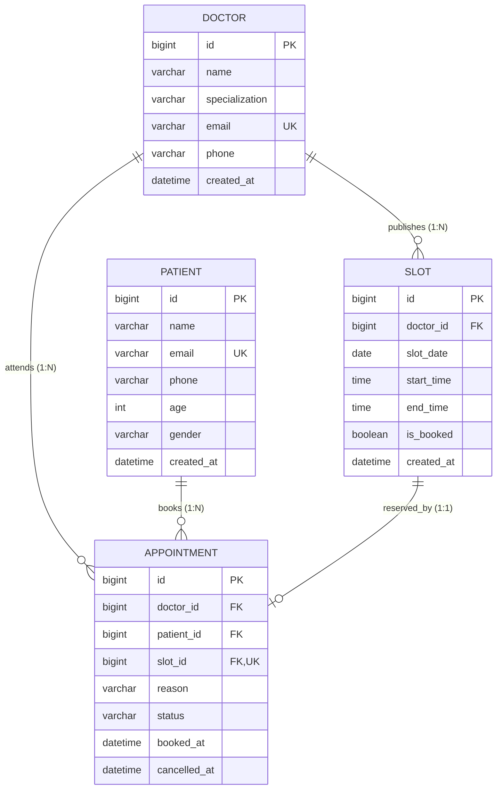

# CliniQ – Simple Doctor Appointment Booking System

A robust, enterprise-grade backend and interactive web management portal designed for neighborhood and campus healthcare clinics. **CliniQ** eliminates phone-tag overlaps, waiting room congestions, and scheduling conflicts by providing published doctor time slots, real-time slot locking, and immediate slot liberation upon appointment cancellation.

---

## 📑 Table of Contents
- [Real-World Problem & Solution](#-real-world-problem--solution)
- [System Architecture & Tech Stack](#-system-architecture--tech-stack)
- [Relational Database Design](#-relational-database-design)
- [Business Rules & Enforcement](#-business-rules--enforcement)
- [Project Directory Structure](#-project-directory-structure)
- [REST API Endpoints Reference](#-rest-api-endpoints-reference)
- [Getting Started & Configuration](#-getting-started--configuration)
- [Interactive Web Portal](#-interactive-web-portal)
- [Swagger UI & API Testing](#-swagger-ui--api-testing)

---

## 🏥 Real-World Problem & Solution

### The Challenge
A small campus or neighborhood clinic handles appointments over phone calls, causing:
- Double bookings and schedule overlaps.
- Long patient waiting times.
- Zero visibility into doctor availability for patients.
- Doctors unable to quickly review their daily schedule.

### The Solution
CliniQ provides:
1. **Slot Publishing for Date Ranges**: Doctors or clinic admins can generate recurring time slots over a specified date range and duration (e.g., 30 mins).
2. **Instant Slot Locking**: When a patient books an open slot, the slot is immediately flagged as booked (`is_booked = true`). Any competing booking attempts are rejected with a clear `409 Conflict` error.
3. **Instant Slot Rebooking on Cancellation**: If an appointment is cancelled, the associated time slot is immediately marked available (`is_booked = false`) for rebooking.
4. **Doctor Daily Schedule**: Instant lookup for doctors to view their scheduled appointments for today.
5. **Clinic Admin Management**: Add/remove doctors, manage medical specializations, and maintain patient records.

---

## 🛠 System Architecture & Tech Stack

- **Backend Framework**: Spring Boot (Spring Web, Spring Data JPA, Hibernate ORM)
- **Validation**: Jakarta Validation (`@NotNull`, `@NotBlank`, `@Email`, `@Positive`)
- **Database**: MySQL 8.0+
- **API Documentation**: SpringDoc OpenAPI 3 / Swagger UI (`/swagger-ui.html`)
- **Frontend**: Clean Vanilla HTML5, CSS3 (Modern Medical Design System), and JavaScript ES6+ (Zero external npm build steps needed)

---

## 🗄 Relational Database Design



### Key Relational Constraints
- **Slot Ownership**: A `Slot` belongs to one `Doctor` (`@ManyToOne`). A unique constraint on `(doctor_id, slot_date, start_time)` prevents overlapping duplicate slots.
- **Appointment Uniqueness**: Each confirmed `Appointment` references exactly one `Slot`. A unique constraint on `slot_id` ensures at the database level that a single slot cannot be assigned to multiple active appointments.
- **Cascading & Soft Deletion**: When appointments are cancelled, status changes to `CANCELLED` and `cancelled_at` is timestamped while freeing the underlying slot.

---

## ⚖ Business Rules & Enforcement

### Rule 1: A slot can only be booked by one patient at a time
- **Service Layer**: In `AppointmentService.bookAppointment()` inside a `@Transactional` block:
  1. Checks `slot.isBooked()`. If `true`, aborts immediately with `SlotAlreadyBookedException` returning HTTP 409 Conflict.
  2. Verifies whether any active `CONFIRMED` appointment is tied to the slot.
  3. Atomically sets `slot.setBooked(true)` and persists the new `Appointment`.
- **Database Layer**: Unique constraint on `slot_id` in the `appointments` table ensures database consistency.

### Rule 2: A cancelled appointment must free the slot immediately for rebooking
- **Service Layer**: In `AppointmentService.cancelAppointment()`:
  1. Checks that the appointment exists and is not already `CANCELLED`.
  2. Sets status to `AppointmentStatus.CANCELLED` and updates `cancelledAt`.
  3. Immediately calls `slot.setBooked(false)` and saves to database.
  4. Returns the updated appointment and fires immediate UI updates.

---

## 📂 Project Directory Structure

```
clinico
│
├── src
│   └── main
│       ├── java
│       │   └── com
│       │       └── clinico
│       │           │
│       │           ├── ClinicoApplication.java
│       │           │
│       │           ├── config
│       │           │   ├── DataInitializer.java
│       │           │   ├── OpenAPIConfig.java
│       │           │   └── WebMvcConfig.java
│       │           │
│       │           ├── controller
│       │           │   ├── AppointmentController.java
│       │           │   ├── DoctorController.java
│       │           │   ├── PatientController.java
│       │           │   └── SlotController.java
│       │           │
│       │           ├── dto
│       │           │   ├── AppointmentRequest.java
│       │           │   ├── DashboardStatsResponse.java
│       │           │   ├── DoctorRequest.java
│       │           │   ├── PatientRequest.java
│       │           │   ├── SlotRangeRequest.java
│       │           │   └── SlotRequest.java
│       │           │
│       │           ├── entity
│       │           │   ├── Appointment.java
│       │           │   ├── AppointmentStatus.java
│       │           │   ├── Doctor.java
│       │           │   ├── Patient.java
│       │           │   └── Slot.java
│       │           │
│       │           ├── exception
│       │           │   ├── ErrorResponse.java
│       │           │   ├── GlobalExceptionHandler.java
│       │           │   ├── InvalidOperationException.java
│       │           │   ├── ResourceNotFoundException.java
│       │           │   └── SlotAlreadyBookedException.java
│       │           │
│       │           ├── repository
│       │           │   ├── AppointmentRepository.java
│       │           │   ├── DoctorRepository.java
│       │           │   ├── PatientRepository.java
│       │           │   └── SlotRepository.java
│       │           │
│       │           └── service
│       │               ├── AppointmentService.java
│       │               ├── DoctorService.java
│       │               ├── PatientService.java
│       │               └── SlotService.java
│       │
│       └── resources
│           │
│           ├── application.properties
│           │
│           └── static
│               │
│               ├── html
│               │   ├── index.html
│               │   ├── doctors.html
│               │   ├── patients.html
│               │   └── appointments.html
│               │
│               ├── css
│               │   └── style.css
│               │
│               └── js
│                   └── script.js
│
├── pom.xml
└── README.md
```

---

## 📡 REST API Endpoints Reference

### 1. Doctors (`/api/doctors`)
| Method | Endpoint | Description |
|---|---|---|
| `GET` | `/api/doctors` | List doctors (supports `?search=` and `?specialization=`) |
| `GET` | `/api/doctors/{id}` | Get single doctor details |
| `POST` | `/api/doctors` | Add a new doctor and specialization |
| `PUT` | `/api/doctors/{id}` | Update doctor profile |
| `DELETE` | `/api/doctors/{id}` | Remove doctor |

### 2. Patients (`/api/patients`)
| Method | Endpoint | Description |
|---|---|---|
| `GET` | `/api/patients` | List patients (supports `?search=`) |
| `GET` | `/api/patients/{id}` | Get single patient profile |
| `POST` | `/api/patients` | Register a new patient |
| `PUT` | `/api/patients/{id}` | Update patient profile |
| `DELETE` | `/api/patients/{id}` | Delete patient |
| `GET` | `/api/patients/{id}/appointments` | View patient appointment history |

### 3. Slots (`/api/slots`)
| Method | Endpoint | Description |
|---|---|---|
| `POST` | `/api/slots` | Create a single appointment slot |
| `POST` | `/api/slots/publish-range` | **Core Feature**: Publish recurring slots across a date range |
| `GET` | `/api/slots/available` | List open unbooked slots (supports `?doctorId=` & `?date=`) |
| `GET` | `/api/slots/doctor/{doctorId}` | Get all slots for a doctor |
| `GET` | `/api/slots/{id}` | Get slot by ID |
| `DELETE` | `/api/slots/{id}` | Delete an unbooked slot |

### 4. Appointments (`/api/appointments`)
| Method | Endpoint | Description |
|---|---|---|
| `POST` | `/api/appointments/book` | **Core Feature**: Book an open slot. Slot becomes booked immediately. |
| `PUT` | `/api/appointments/{id}/cancel` | **Core Feature**: Cancel appointment and immediately free slot for rebooking. |
| `GET` | `/api/appointments/doctor/{doctorId}/today` | **Core Feature**: View today's appointments for a doctor. |
| `GET` | `/api/appointments` | Filterable list (`?doctorId=`, `?patientId=`, `?date=`, `?status=`) |
| `GET` | `/api/appointments/{id}` | Get appointment by ID |
| `GET` | `/api/appointments/dashboard/stats` | Dashboard statistics (doctors, patients, slots, today's bookings) |

---

## ⚙ Getting Started & Configuration

### Prerequisites
- **Java**: JDK 17 or higher (`java -version`)
- **MySQL**: MySQL Server 8.0+ running on port 3306

### 1. Database Credentials in `application.properties`
Open `src/main/resources/application.properties` and verify your MySQL password:
```properties
spring.datasource.url=jdbc:mysql://localhost:3306/clinico?createDatabaseIfNotExist=true&useSSL=false&allowPublicKeyRetrieval=true&serverTimezone=UTC
spring.datasource.username=root
spring.datasource.password=root
```
*(The schema `clinico` will automatically be created if it does not already exist).*

### 2. Build & Run Application
From the project root:
```powershell
.\mvnw.cmd spring-boot:run
```
Or on Linux/macOS:
```bash
./mvnw spring-boot:run
```

Once started, sample demo data (doctors, patients, and initial slots) is automatically seeded for immediate testing!

---

## 💻 Interactive Web Portal

Open your web browser and navigate to:
👉 **[http://localhost:8080/](http://localhost:8080/)**

- **Dashboard** (`/html/index.html`): Key metrics, today's schedule, open slots.
- **Doctors** (`/html/doctors.html`): Add doctors, publish slots for date range, view slots.
- **Patients** (`/html/patients.html`): Register patients, view booking histories.
- **Appointments** (`/html/appointments.html`): Dynamic slot selector, book appointment, cancel appointments with immediate slot freeing!

---

## 📖 Swagger UI & API Testing

Access interactive OpenAPI documentation:
👉 **[http://localhost:8080/swagger-ui.html](http://localhost:8080/swagger-ui.html)**

### Sample Request Payloads

#### 1. Publish Slots for Date Range (`POST /api/slots/publish-range`)
```json
{
  "doctorId": 1,
  "startDate": "2026-10-01",
  "endDate": "2026-10-05",
  "dailyStartTime": "09:00",
  "dailyEndTime": "12:00",
  "durationMinutes": 30
}
```

#### 2. Book an Appointment (`POST /api/appointments/book`)
```json
{
  "patientId": 1,
  "slotId": 2,
  "reason": "Routine checkup and blood pressure review"
}
```

#### 3. Cancel an Appointment (`PUT /api/appointments/1/cancel`)
*Frees the underlying slot immediately for rebooking.*
Response returns `status: "CANCELLED"` and slot becomes available again under `GET /api/slots/available`.
